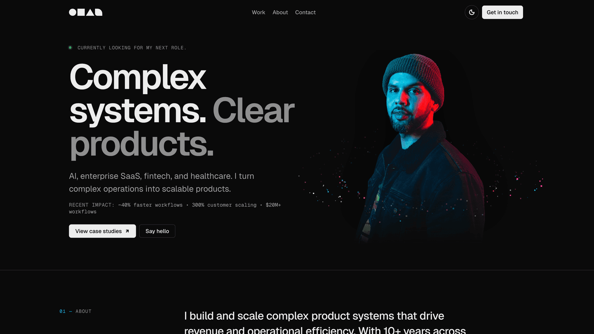
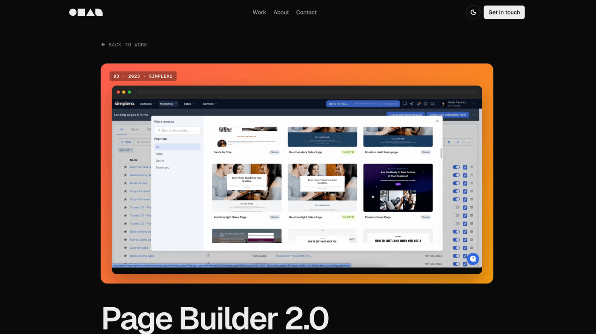
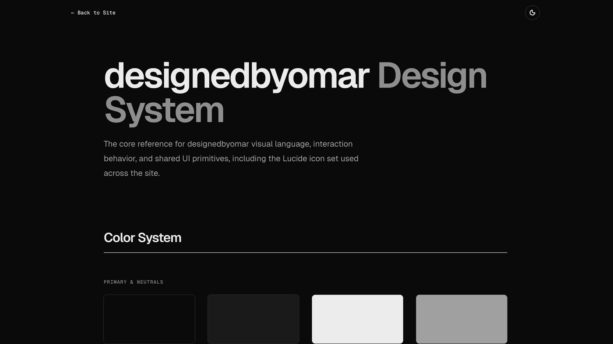

# designedbyomar

Portfolio site for **Omar Tavarez** — product design for AI workflows, design systems, fintech, healthcare SaaS, and enterprise product strategy.

🌐 **Live:** [designedbyomar.com](https://designedbyomar.com)
✉️ **Contact:** [omar@designedbyomar.com](mailto:omar@designedbyomar.com)
🧑‍💼 **Hiring:** open to Head of Design, Principal Product Designer, and senior / staff / fractional product design and design-engineering roles.

---

## Why this repo is public

This site is both my portfolio and a public artifact showing how I work today: using AI-assisted tools to move from strategy → design system → production UI, while keeping product judgment, brand, and UX decisions human-led.

If you're a hiring manager or founder, the things to look at are:

1. The site itself — [designedbyomar.com](https://designedbyomar.com)
2. The case studies in [`postbuild.js`](./postbuild.js) — each gets its own crawlable, SEO-tagged route.
3. The design-system reference page at [`/design-system.html`](https://designedbyomar.com/design-system.html).
4. The AI-assisted workflow notes in [`docs/ai-workflow.md`](./docs/ai-workflow.md).

## Screenshots

| Homepage | Case study | Design system |
|---|---|---|
|  |  |  |

## What's in here

- **Custom React 19 + Vite 8 single-page app** with multi-entry build (homepage, design-system page, 404).
- **Static route generation** in [`postbuild.js`](./postbuild.js) — each case study gets its own URL with unique title, description, OG, Twitter card, canonical, and JSON-LD.
- **Design system reference page** at `/design-system.html` documenting tokens, spacing, typography, motion, iconography, and theming. The codebase is mid-migration to fully tokenized values (see recent commits — gradient, typography, motion, and spacing token phases).
- **SEO + sharing**: canonical, Open Graph, Twitter card, JSON-LD (`WebSite` + `Person`), robots directives, sitemap.xml, and an [`llms.txt`](./public/llms.txt) for AI crawlers.
- **Analytics + monitoring**: Vercel Analytics, Vercel Speed Insights, Sentry (gated on `VITE_SENTRY_DSN`).
- **Security headers** via [`vercel.json`](./vercel.json): `X-Content-Type-Options`, `X-Frame-Options`, `X-XSS-Protection`, `Strict-Transport-Security`, `Referrer-Policy`.
- **Image pipeline**: `sharp`-based [`scripts/optimize-image.mjs`](./scripts/optimize-image.mjs) for image optimization.

## Stack

| Concern | Tool |
|---|---|
| Framework | React 19 |
| Build | Vite 8 (multi-entry) |
| Hosting | Vercel (canonical) |
| Analytics | `@vercel/analytics`, `@vercel/speed-insights` |
| Error monitoring | `@sentry/react` (optional) |
| Icons | `lucide-react` |
| Image optimization | `sharp` |

## Local development

```bash
nvm use            # uses .nvmrc → Node 20+
npm install
npm run dev
```

## Production build

```bash
npm run build      # vite build → dist/, then postbuild.js generates per-case-study routes
npm run preview    # preview the built dist/ locally
```

## Smoke test

There is no unit test suite yet. `npm test` runs the production build as a smoke test:

```bash
npm test
```

## Deploy

Canonical deploy target is **Vercel**. The repo is wired up via [`vercel.json`](./vercel.json) with security headers and a single rewrite to the SPA shell.

- Build command: `npm run build`
- Output directory: `dist`
- Env: set `VITE_SENTRY_DSN` to enable Sentry. Without it, the site builds and ships normally.

## Quality checklist

- [x] Production build passes
- [x] Responsive layout reviewed across mobile / tablet / desktop breakpoints
- [x] Reduced-motion respected for the canvas / motion components
- [x] SEO metadata: canonical, OG, Twitter, JSON-LD, sitemap, robots, llms.txt
- [x] Error monitoring wired (optional via env)
- [x] Security headers configured
- [ ] Unit / E2E test suite (intentionally deferred — see [`docs/ai-workflow.md`](./docs/ai-workflow.md))
- [x] CI workflow — build runs on every PR and push to main

## Project layout

```
.
├── index.html                      # main app entry
├── design-system.html              # design system entry
├── 404.html                        # static 404
├── postbuild.js                    # per-case-study route generation
├── vite.config.js                  # multi-entry rollup config
├── vercel.json                     # security headers + SPA rewrite
├── public/
│   ├── Images/                     # portrait, OG, share assets
│   ├── Videos/                     # case study cover videos
│   ├── Omar Tavarez Resume.pdf
│   ├── llms.txt                    # AI crawler directive
│   ├── robots.txt
│   └── sitemap.xml
├── scripts/
│   └── optimize-image.mjs          # sharp-based image optimizer
├── src/
│   ├── main.jsx                    # main site app (in active token migration)
│   ├── design-system.jsx           # design system reference page
│   ├── footer-alien.jsx
│   ├── ui-icons.jsx
│   └── constants.js                # nav / route / breakpoint constants
└── docs/
    └── ai-workflow.md              # how AI is used in this repo
```

## License

MIT — see [LICENSE](./LICENSE).
