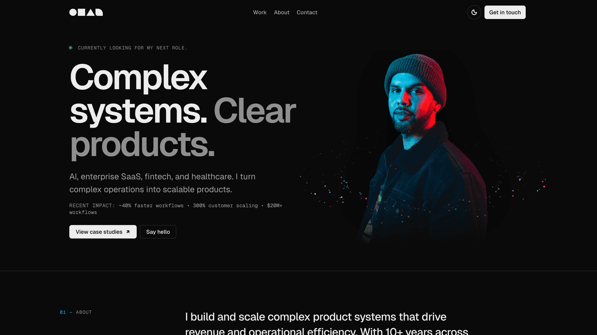
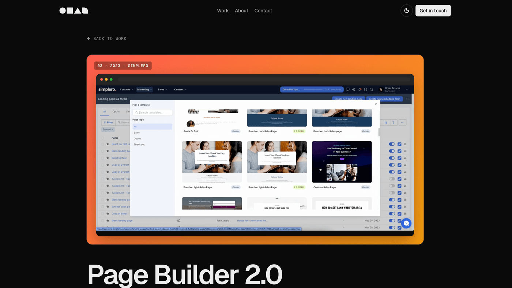
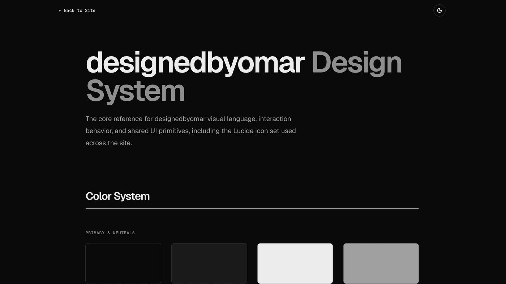

# designedbyomar

Portfolio site for **Omar Tavarez** — product design for AI workflows, design systems, fintech, healthcare SaaS, and enterprise product strategy.

🌐 **Live:** [designedbyomar.com](https://www.designedbyomar.com)
✉️ **Contact:** [omar@designedbyomar.com](mailto:omar@designedbyomar.com)
🧑‍💼 **Hiring:** open to Head of Design, Principal Product Designer, and senior / staff / fractional product design and design-engineering roles.

---

## Why this repo is public

This site is both my portfolio and a public artifact showing how I work today: using AI-assisted tools to move from strategy → design system → production UI, while keeping product judgment, brand, and UX decisions human-led.

If you're a hiring manager or founder, the things to look at are:

1. The site itself — [designedbyomar.com](https://www.designedbyomar.com)
2. The case studies in [`src/content/case-studies.json`](./src/content/case-studies.json) — shared by the app and static route generator so each gets its own crawlable, SEO-tagged route.
3. The design-system guide in [`DESIGN.md`](./DESIGN.md) and the public reference page at [`/design-system`](https://www.designedbyomar.com/design-system).
4. The AI-assisted workflow notes in [`docs/ai-workflow.md`](./docs/ai-workflow.md).
5. The brand and product intent in [`PRODUCT.md`](./PRODUCT.md) — target users, product purpose, anti-references, and the design principles every decision is checked against.

## Screenshots

| Homepage | Case study | Design system |
|---|---|---|
|  |  |  |

## What's in here

- **Custom React 19 + Vite 8 single-page app** with multi-entry build (homepage, design-system page, 404).
- **Shared case-study content** in [`src/content/case-studies.json`](./src/content/case-studies.json), consumed by [`src/case-studies.js`](./src/case-studies.js) and [`postbuild.js`](./postbuild.js) so UI content, route metadata, and generated sitemap entries stay aligned.
- **Static route generation** in [`postbuild.js`](./postbuild.js) — each case study gets its own URL with unique title, description, OG, Twitter card, canonical, and JSON-LD.
- **Design system guide** in [`DESIGN.md`](./DESIGN.md), plus a public reference page at `/design-system` documenting tokens, components, patterns, motion, content, accessibility, and theming.
- **SEO + sharing**: canonical, Open Graph, Twitter card, JSON-LD (`WebSite` + `Person` + `FAQPage`), robots directives, generated `sitemap.xml`, and an [`llms.txt`](./public/llms.txt) for AI crawlers.
- **Analytics + monitoring**: Vercel Analytics, Vercel Speed Insights, Google Analytics 4 (consent-gated — loaded only after explicit user acceptance), Sentry (gated on `VITE_SENTRY_DSN`).
- **Live GitHub activity**: a rolling one-year contribution calendar backed by GitHub GraphQL and cached through a same-origin Vercel function.
- **Security headers** via [`vercel.json`](./vercel.json): `X-Content-Type-Options`, `X-Frame-Options`, `X-XSS-Protection`, `Strict-Transport-Security`, `Referrer-Policy`.
- **Image pipeline**: `sharp`-based [`scripts/optimize-image.mjs`](./scripts/optimize-image.mjs) for image optimization, plus automatic responsive WebP card covers and 1200×627 JPEG social previews for every case study during production builds.

## Stack

| Concern | Tool |
|---|---|
| Framework | React 19 |
| Build | Vite 8 (multi-entry) |
| Hosting | Vercel (canonical) |
| Analytics | `@vercel/analytics`, `@vercel/speed-insights`, Google Analytics 4 (consent-gated) |
| Error monitoring | `@sentry/react` (optional) |
| Code review | CodeRabbit, Greptile, human review |
| Icons | `lucide-react` |
| Image optimization | `sharp` |

## Local development

```bash
nvm use            # uses .nvmrc → Node 20+
npm install
npm run dev
```

## Production build

```bash
npm run build      # vite build → dist/, then postbuild.js generates routes and sitemap.xml
npm run preview    # preview the built dist/ locally
```

The build first runs `scripts/generate-responsive-case-images.mjs` and `scripts/generate-social-images.mjs`. They create 640px, 960px, and 1440px WebP card covers plus a center-cropped, share-safe `cover-og.jpg` without changing the original on-page cover.

## Automated tests

`npm test` runs the production build, SEO/static assertions, and Chromium Playwright E2E tests:

```bash
npm test            # full automated suite
npm run test:build  # production build smoke test only
npm run test:seo    # generated metadata, sitemap, and discovery checks
npm run test:e2e    # build, preview, and Playwright browser checks
npm run test:e2e:ui # optional interactive Playwright UI
```

GitHub Actions runs the full suite automatically on every pull request and every push to `main`, alongside `npm audit --audit-level=high` and `npm run lint` — a high-severity advisory or a single lint warning fails the build. Playwright's UI mode is local-only and requires user interaction.

Future unit tests should be added when route parsing, metadata generation, or analytics helpers are extracted from `src/main.jsx` / `postbuild.js`.

If Playwright browsers are not installed locally yet, run:

```bash
npx playwright install chromium
```

## Deploy

Canonical deploy target is **Vercel**. The repo is wired up via [`vercel.json`](./vercel.json) with security headers and a single rewrite to the SPA shell.

- Build command: `npm run build`
- Output directory: `dist`
- Environment variables:
  - `GITHUB_CONTRIBUTIONS_TOKEN` enables the live contribution calendar. Use a minimally scoped fine-grained personal access token with public-resource access only, store it in Vercel rather than the client, and rotate it before its expiration date.
  - `VITE_SENTRY_DSN` enables Sentry. Without it, the site builds and ships normally.

The GitHub widget degrades to a profile link when its token or upstream data is unavailable. The token is read only by `/api/github-contributions` and is never included in the browser bundle or response.

After deployment, smoke-test the real function and its cache contract:

```bash
npm run smoke:github -- --url https://www.designedbyomar.com/api/github-contributions
```

The smoke command verifies both the five-minute browser cache and the forwarded six-hour CDN cache policy. Vercel consumes its platform-specific cache header before the response reaches the browser, so the endpoint also sends the equivalent standards-based `CDN-Cache-Control` header for deployment verification.

To verify the explicit missing-token fallback against an unprotected preview that intentionally omits the secret, add `--expect-fallback`.

## Branch workflow

Keep `main` protected and deployable. Use short-lived feature branches for one focused change at a time, then merge through a pull request.

**Rules:**
- Always branch from `main` — never from another feature branch unless explicitly stacking work.
- One branch per logical unit of work. If you find unrelated cleanup while working on a feature, open a separate branch for it.
- After a requested change is complete and validated, automatically commit the task-scoped files and push the branch unless the requester explicitly asks to leave the work uncommitted.
- Reuse and update the branch's open pull request when one exists; otherwise open a new pull request against `main`.
- Never include unrelated working-tree changes, secrets, generated builds, or ignored local files in an automatic commit.
- Merge and delete promptly. Stale branches add noise; GitHub can auto-delete on merge (repo Settings → General → "Automatically delete head branches").

**Prefixes:**

- `feat/` — new sections or new functionality
- `fix/` — broken behavior, SEO cleanup, redirects, bugs
- `design/` — visual, theme, typography, spacing, or design-system changes
- `content/` — copy, case studies, resume/about edits
- `chore/` — tooling, docs, dependency maintenance

**Example:**

```bash
git switch main
git pull
git switch -c fix/canonical-host
# ... make changes ...
git push -u origin fix/canonical-host
# open PR → merge → branch auto-deleted
```

## Releases

Versions follow [semver](https://semver.org/) and are recorded in three places that must agree: the [`VERSION`](./VERSION) file, the `version` field in [`package.json`](./package.json), and the heading in [`CHANGELOG.md`](./CHANGELOG.md). Every release is tagged and published as a GitHub release.

Work accumulates under `## [Unreleased]` in the changelog as it merges. Cutting a release closes that block out:

```bash
git switch main && git pull
# bump VERSION and package.json to the same number
# rename the CHANGELOG [Unreleased] heading to [X.Y.Z] - YYYY-MM-DD
npm run build && npm run lint && npm test   # all must pass
git switch -c chore/release-X.Y.Z
# commit, push, open a PR, merge
git switch main && git pull
git tag -a vX.Y.Z -m "designedbyomar X.Y.Z"
git push origin vX.Y.Z
gh release create vX.Y.Z --title "..." --notes "..."
```

Bump **minor** when the release adds capability or changes how something is rendered or served; **patch** for fixes, copy, and maintenance. Keeping `VERSION` and `package.json` in the same commit is what stops them drifting apart.

## Quality checklist

- [x] Production build passes
- [x] Responsive layout reviewed across mobile / tablet / desktop breakpoints
- [x] Reduced-motion respected for the canvas / motion components
- [x] SEO metadata: canonical, OG, Twitter, JSON-LD, sitemap, robots, llms.txt
- [x] Analytics wired: GA4, Vercel Analytics, and Vercel Speed Insights
- [x] Error monitoring wired (optional via env)
- [x] External code review wired through CodeRabbit and Greptile
- [x] Security headers configured
- [x] Automated E2E + SEO regression tests
- [x] CI workflow — full automated suite runs on every PR and push to main

## Project layout

```
.
├── index.html                      # main app entry
├── DESIGN.md                       # agent-readable design system guide
├── PRODUCT.md                      # brand personality, product purpose, design principles
├── design-system.html              # design system source entry, served publicly at /design-system
├── 404.html                        # static 404
├── postbuild.js                    # per-case-study route generation
├── vite.config.js                  # multi-entry rollup config
├── vercel.json                     # security headers + SPA rewrite
├── playwright.config.mjs           # e2e test runner config
├── eslint.config.mjs               # lint rules
├── CHANGELOG.md                    # dated, categorized release notes
├── VERSION                         # semver, kept in sync with package.json + CHANGELOG
├── SECURITY.md                     # vulnerability disclosure policy
├── api/                            # Vercel serverless functions
│   ├── ask.mjs                     # Ask box routing + answer drafting
│   ├── contact.mjs                 # contact form submission (Resend)
│   └── github-contributions.mjs    # cached GitHub activity endpoint
├── public/
│   ├── Images/                     # portrait, OG, share assets
│   ├── Videos/                     # case study cover videos
│   ├── Omar Tavarez Resume.pdf
│   ├── llms.txt                    # AI crawler directive
│   └── robots.txt                  # references generated /sitemap.xml
├── scripts/
│   ├── optimize-image.mjs          # sharp-based image optimizer
│   ├── generate-responsive-case-images.mjs # responsive WebP case-card covers
│   ├── generate-social-images.mjs  # 1200×627 JPEG social previews
│   ├── ask-fingerprint.mjs         # content-hash guard for reviewed Ask answers
│   ├── build-ask-corpus.mjs        # case-study corpus for Ask drafting
│   ├── ask-rundown.mjs             # GA4 report of unanswered Ask questions
│   └── smoke-github-contributions.mjs # prod smoke check for the GitHub endpoint
├── src/
│   ├── main.jsx                    # main site app shell and homepage experience
│   ├── case-studies.js             # normalized case-study content exports
│   ├── routes.js                   # route parsing and route metadata helpers
│   ├── ask.mjs                     # Ask matching/answer logic (shared with api/ask.mjs)
│   ├── analytics-env.mjs           # production-host + build-mode GA gating
│   ├── design-system.jsx           # design system reference page
│   ├── design-tokens.css           # shared token source for app entries
│   ├── galaxy.jsx                  # hero canvas animation
│   ├── constants.js                # nav / route / breakpoint constants
│   ├── content/                    # canonical content sources
│   │   ├── case-studies.json       # canonical case-study content
│   │   ├── ask-answers.json        # reviewed Ask answers
│   │   ├── rate-card.mjs           # rate-card service/pricing content
│   │   └── privacy-policy.mjs      # privacy policy copy
│   └── ui/                         # shared UI components
│       ├── navigation.jsx
│       ├── ask-panel.jsx
│       ├── case-card.jsx
│       ├── inquiry-form.jsx
│       └── site-footer.jsx
├── tests/
│   ├── seo-static.test.mjs         # static-route SEO regression checks
│   ├── ask-answers.test.mjs        # Ask content fingerprint + evidence checks
│   ├── analytics-env.test.mjs      # GA host/build gating unit tests
│   └── e2e/                        # Playwright end-to-end suite
└── docs/
    └── ai-workflow.md              # how AI is used in this repo
```

## License

MIT — see [LICENSE](./LICENSE).

## Rate-card inquiries

The unlinked services page can send inquiries to Omar’s inbox through `POST /api/contact`. Configure `RESEND_API_KEY` (sending-only), `CONTACT_FROM_EMAIL` (for example `Website inquiries <inquiries@designedbyomar.com>`), and `TURNSTILE_SECRET_KEY` server-side, plus `VITE_TURNSTILE_SITE_KEY` at build time. The Resend domain must be verified. Use Turnstile managed mode with the exact production and approved preview hostnames. Vercel’s `VERCEL_URL` and `VERCEL_BRANCH_URL` are accepted as exact preview hosts; `CONTACT_PREVIEW_HOST` can specify one additional exact test alias. No wildcard preview host is accepted.

Configure preview variables first and rebuild the preview after changing the public site key. Confirm an inquiry arrives in `omar@designedbyomar.com` before enabling production sending. Never use Cloudflare test keys or bypass verification on a deployed preview or production site; the test build uses a public fixture key only with intercepted browser requests. Missing configuration or failed discovery leaves direct email available.

The endpoint fixes the recipient and uses the visitor’s address only for reply-to. It sends plain text, uses Resend idempotency for retries, and sends no automatic acknowledgment. Its five-attempt/ten-minute per-instance limiter is supplemental to server-validated Turnstile and a honeypot; it is not a global distributed quota. Form values are kept in memory, are excluded from analytics, and are not logged by the handler.
